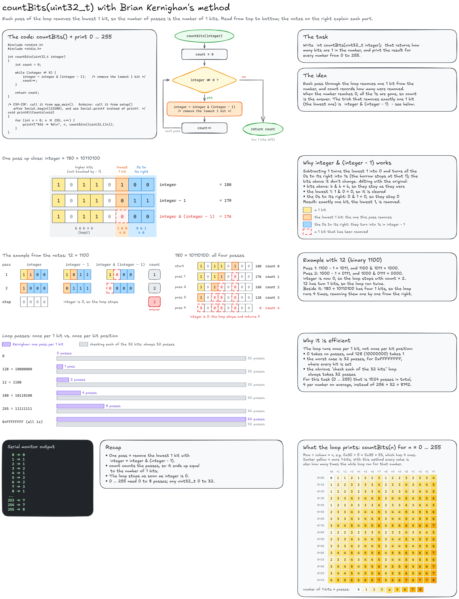
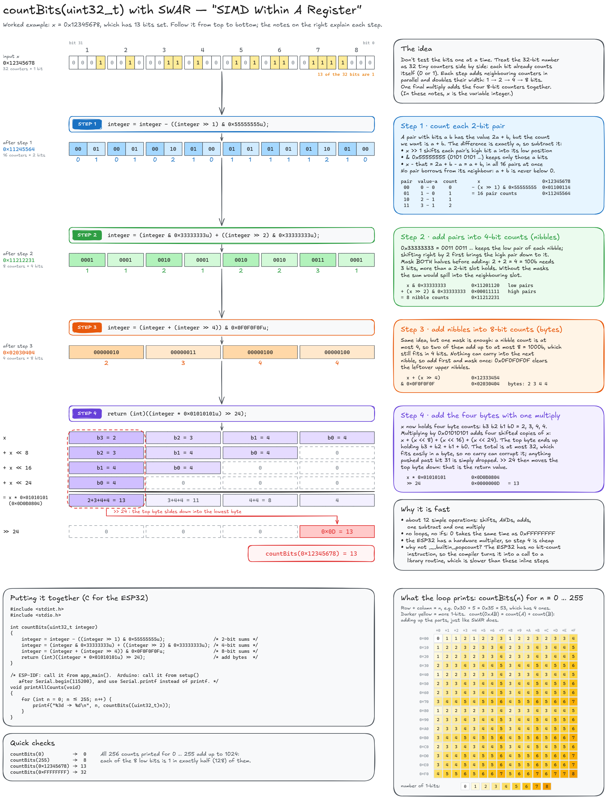

# HW2-1: Counting set bits in a `uint32_t`

Write `int countBits(uint32_t integer);`, which returns how many bits of the number are 1, and print the result for every number from 0 to 255.

There are two versions. Both define `countBits()` and `app_main()`, so `CMakeLists.txt` lists only one of them in `SRCS`:

| File | Method |
| --- | --- |
| `main.c` | Brian Kernighan's method (built by default) |
| `main_swar.c` | SWAR, "SIMD Within A Register" |

## Method 1: Brian Kernighan's method

Editable source: [`countBits_Kernighan.excalidraw`](countBits_Kernighan.excalidraw)

## Method 2: SWAR

Editable source: [`countBits_SWAR.excalidraw`](countBits_SWAR.excalidraw)
