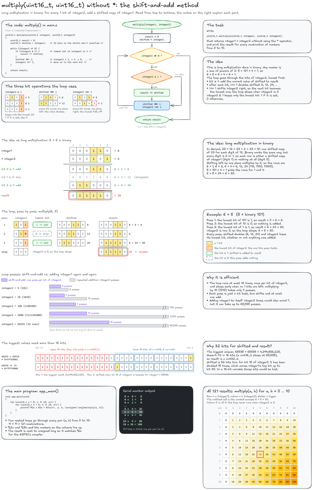

# HW2-2: Multiplying two `uint16_t` without `*`

Write `uint32_t multiply(uint16_t integer1, uint16_t integer2);`, which returns `integer1 x integer2` without using the `*` operator, and print the result for every combination of numbers from 0 to 10.

The solution in `main.c` uses the shift-and-add method.

Editable source: [`multiply_ShiftAndAdd.excalidraw`](multiply_ShiftAndAdd.excalidraw)
