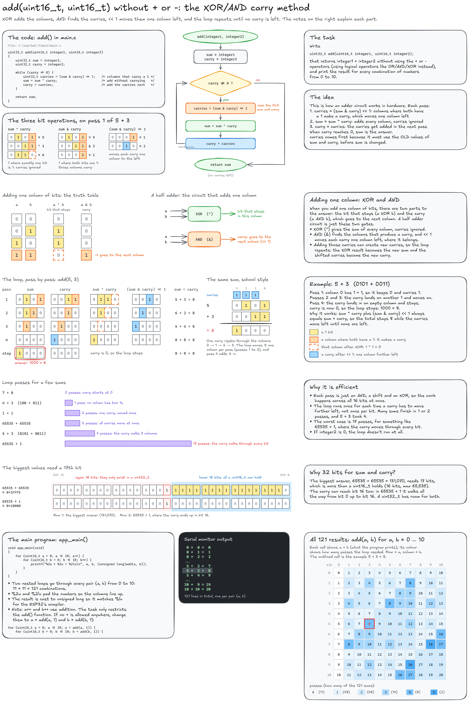

# HW2-3: Adding two `uint16_t` without `+` or `-`

Write `uint32_t add(uint16_t integer1, uint16_t integer2);`, which returns `integer1 + integer2` using only logical operators (no `+` or `-`), and print the result for every combination of numbers from 0 to 10.

The solution in `main.c` uses the XOR/AND carry method.

Editable source: [`add_XorAndCarry.excalidraw`](add_XorAndCarry.excalidraw)
